# 云端小窝 CloudNest · 像素云养宠 Demo

> 一款治愈系像素风云养宠小游戏 Demo。面向喜欢小动物、却因为各种原因无法真实养宠的人。
> 适合通勤路上、下班回家后、睡前放松身心——**就算再忙，也有人在等你回家。**

---

## 一、快速体验

Demo 是**纯前端单文件应用**（HTML + CSS + JavaScript + Canvas），无需安装任何依赖：

| 方式 | 操作 |
| --- | --- |
| 最简 | 直接用浏览器打开 `index.html` 即可（存档保存在浏览器 localStorage） |
| 推荐 | `npx serve .` 或任意静态服务器启动后访问，可体验 PWA 安装 |
| 装成 App | 通过 https/localhost 打开后，浏览器菜单「安装应用」即可像 APP 一样全屏使用 |

> 设置页内置了「演示时间加速」开关（1x / 10x / 1时/分钟 / 1天/4分 / 1天/分钟），
> 方便快速看到宠物长大、饥饿、生病、离开星星的完整循环。离线未登录的时间也会结算。

### 屏幕截图

| | | |
| --- | --- | --- |
| 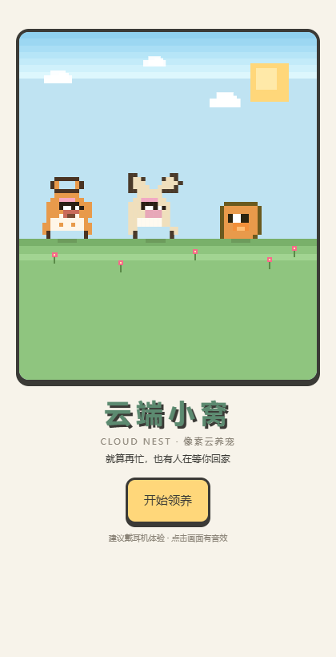 | 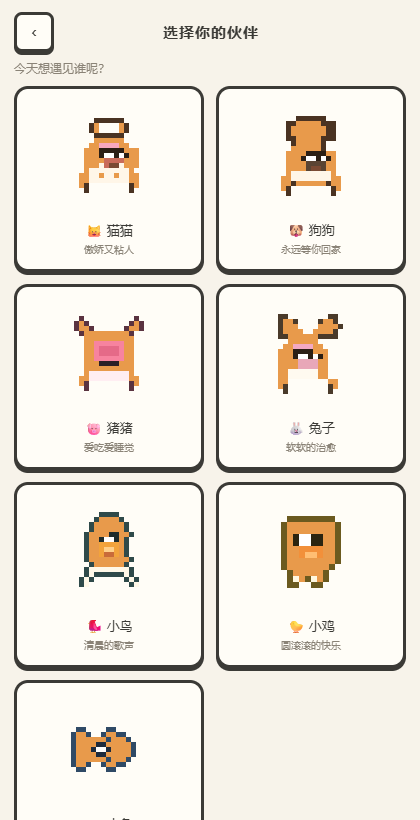 | 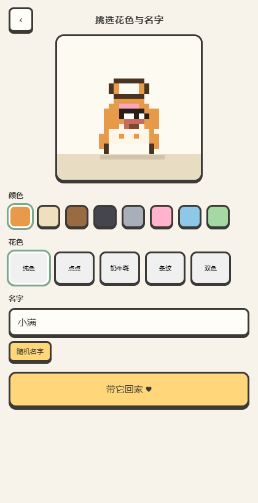 |
| 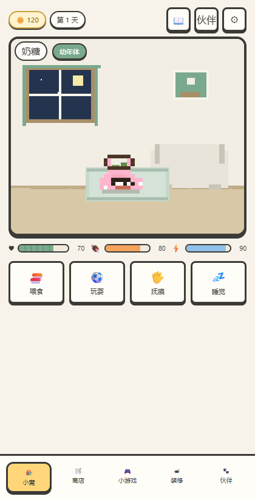 | 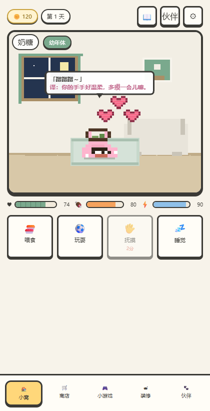 | 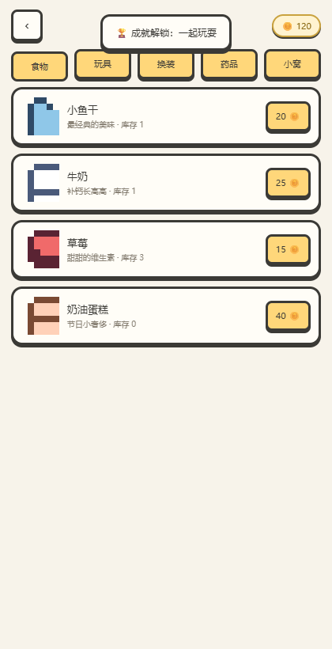 |
| 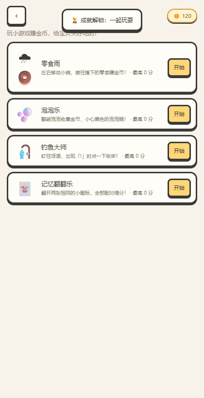 | 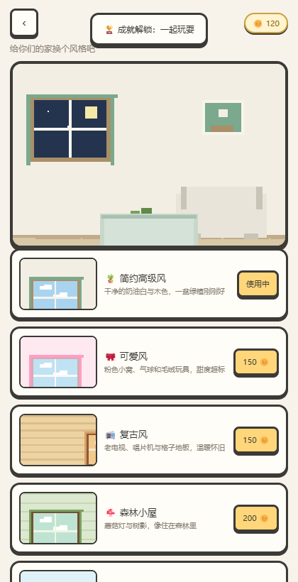 | 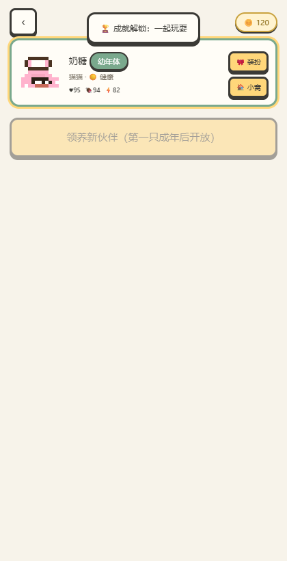 |
| 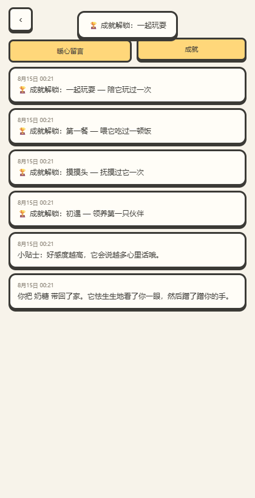 | 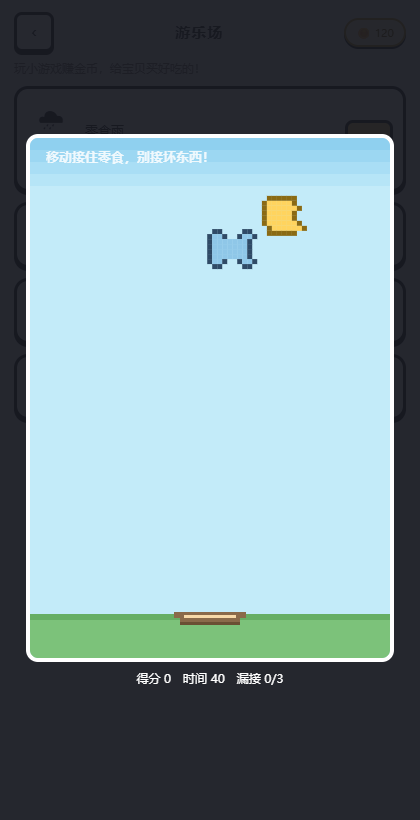 | 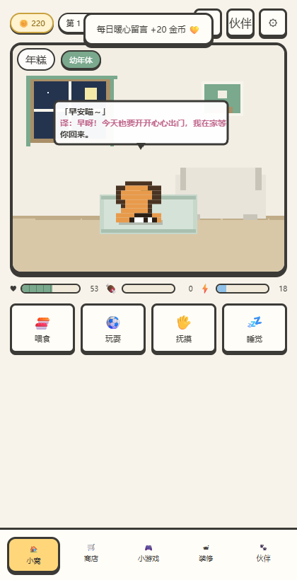 |
| 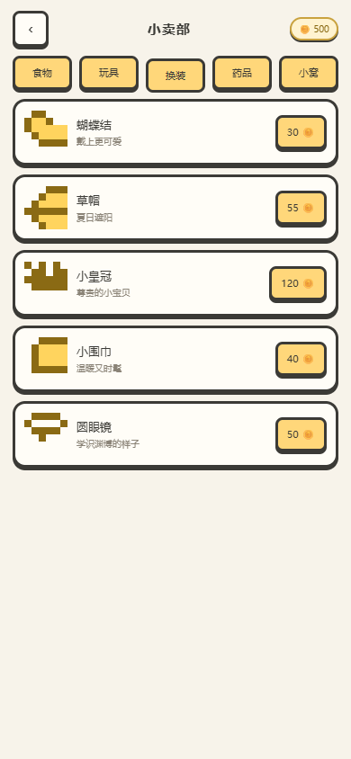 | 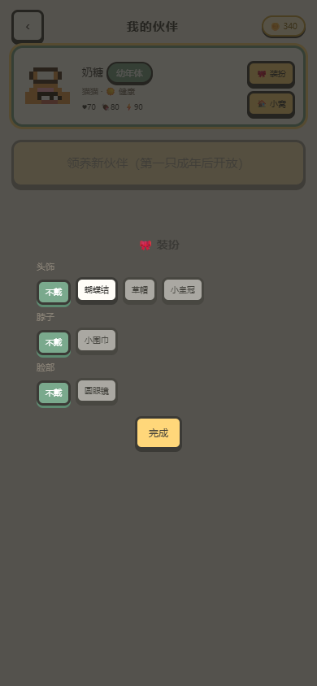 | 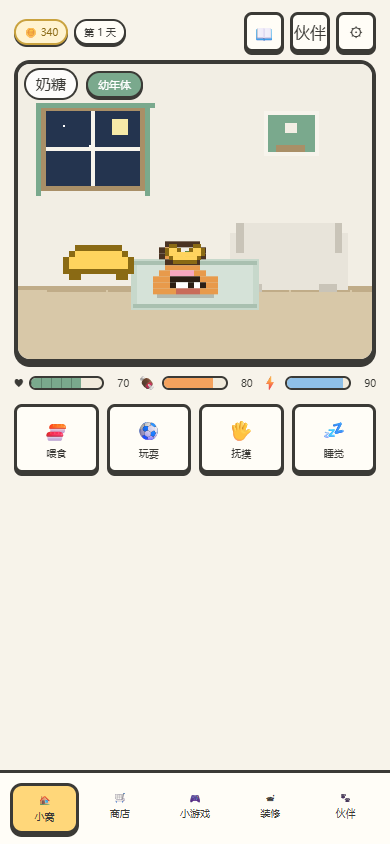 |
| 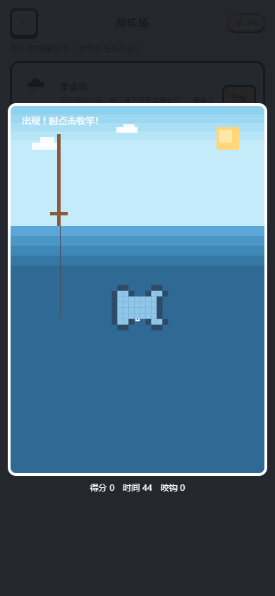 | 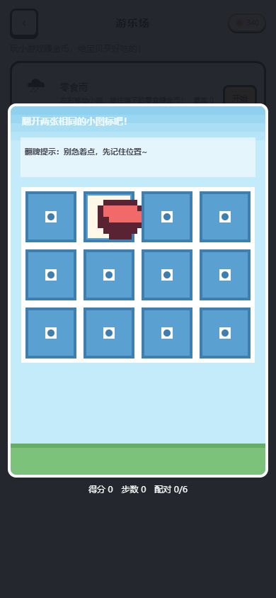 | 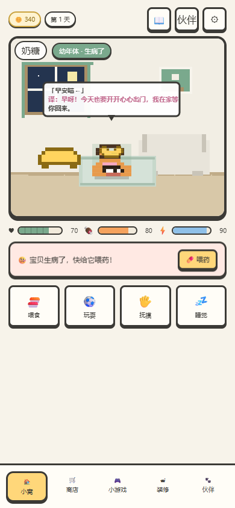 |

---

## 二、已实现功能（对照需求）

| 需求 | Demo 实现 |
| --- | --- |
| 首次选择宠物类型 | 猫猫 / 狗狗 / 猪猪 / 兔子 / 小鸟 / 小鸡 / 小鱼，共 7 种像素宠物 |
| 选择花色 | 8 种基础色（橘橙、奶白、巧克力、玄黑、银灰、**樱花粉**、天空蓝、薄荷绿）× 5 种花色（纯色、点点、奶牛斑、条纹、双色），粉色猫咪当然可以养 |
| 三个成长阶段 | 幼年体（大头萌版）→ 青年体 → 成年体，通过互动积累成长值进化，成年后解锁领养第二只 |
| 玩耍/抚摸/喂食 | 互动会加好感/成长，喂食消耗食物库存；每个动作有冷却时间 |
| 长期不登录/不喂食扣好感甚至死亡 | 时间系统会离线结算：饱食持续下降 → 好感下降 → 生病 → 去星星上；可用「回忆之光」召回 |
| 养大后买第二只 | 第一只成年后可花 300 金币领养新伙伴（最多 4 只，可切换陪伴） |
| 小游戏赚金币 | 零食雨、泡泡乐、钓鱼大师、记忆翻翻乐，共 4 款，金币用来买粮食和玩具 |
| 商店更多分类 | 食物（小鱼干/牛奶/草莓/奶油蛋糕/胡萝卜/红苹果）、玩具（毛线球/逗猫棒/软软垫）、换装（蝴蝶结/草帽/皇冠/围巾/眼镜）、药品（感冒药/活力药剂/万能灵药）、小窝（云朵床/原木小屋/太空舱/蘑菇窝/树屋），图标为 AI 生成的像素图 |
| 随机生病 | 宠物有小概率随机生病（约 1.2%/小时），需要买药喂药；小窝提供睡觉/抚摸加成 |
| 更多场景 | 5 套装修主题：简约、可爱、复古、森林小屋、海边度假 |
| 宠物说话翻译 | 每次互动都有「宠物语 + 翻译」气泡；好感高时有专属表白，例如「妈妈我会一直爱你」 |
| 宠物日记 | 所有暖心留言、成就、离线思念都会记进日记 |
| 像素风 / 星露谷气质 | 全部画面为代码绘制的像素画（Canvas + image-rendering: pixelated），温暖低饱和配色 |
| 多个装修风格 | 简约高级风 / 可爱风 / 复古风 / 森林小屋 / 海边度假，房间背景为 AI 生成像素场景，还有昼夜光影 |

### 额外补充的设定

- **状态三围**：好感（♥）决定亲密度与说话内容、饱食（🍖）决定健康、精力（⚡）决定睡眠需求；
- **成就感系统**：10 个成就（初遇、第一餐、挚爱时刻、长大啦、家人团聚、小富翁……）；
- **离线思念**：隔天回来会看到「XX 在窗边等了你 N 天」的暖心记录，并触发每日登录奖励；
- **治愈系翻译**：低好感时宠物会怯怯地说「你是不是把我忘啦」，高好感时会说「妈妈我会一直爱你」「只要你在，我就什么都不怕」；
- **音效**：WebAudio 合成的芯片音（点击、喂食、抚摸、升级、金币……），可在设置中关闭。

---

## 三、核心数值设计

| 数值 | 初始 | 衰减/效果 | 说明 |
| --- | --- | --- | --- |
| 好感 | 70 | 每小时 -0.35；饥饿时额外 -1.2/时 | ≥80 进入「挚爱」语料库 |
| 饱食 | 80 | 每小时 -2.2 | 归零 30 小时生病、60 小时去星星 |
| 精力 | 90 | 每小时 -1.5 | 睡觉 +60 |
| 成长值 | 0 | 互动获得 | 120 → 青年体；360 → 成年体 |
| 生病 | 随机 ~1.2%/小时；饥饿也会生病 | 感冒药 50 / 活力药剂 60 / 万能灵药 120 |
| 小窝 | 云朵床/原木小屋/太空舱 | 睡觉 +15~25 精力、抚摸 +2 好感 |
| 金币 | 120 | 小游戏 + 每日登录 | 买食物玩具、装修、领养、召回 |

互动效果（均有冷却）：喂食 +饱食/成长/好感（消耗食物）；玩耍 +成长/好感（有玩具加成）；抚摸 +好感/成长；睡觉 +精力。

经济循环：**玩小游戏赚金币 → 小卖部买食物/玩具 → 陪伴宠物长大 → 换装修/领养新伙伴**。

---

## 四、参考的 GitHub 开源项目

| 项目 | 链接 | 可借鉴的点 |
| --- | --- | --- |
| Labubu Virtual Pet | [wonderchatai/labubu-game](https://github.com/wonderchatai/labubu-game) | Phaser 3 + localStorage 的纯前端架构、离线进度结算、数值随时间衰减、经济系统 |
| 虚拟桌宠模拟器 VPet | [LorisYounger/VPet](https://github.com/LorisYounger/VPet) | 多状态多动画的互动设计（摸头/提起/爬墙）、说话栏、创意工坊式 MOD 扩展（Apache-2.0，动画另有授权） |
| EvoPet | [ByteHub-1337/EvoPet](https://github.com/ByteHub-1337/EvoPet) | 深度养成灵感：性格、记忆、梦境日记、成长阈值与最小天数、死亡告别与遗产（MIT） |
| sardips | [sardap/sardips](https://github.com/sardap/sardips) | 反面教材 + 宝藏：38 只宠物/40 种食物/全套翻译系统/开发者控制台（含时间加速指令）——**警惕功能过度膨胀** |
| Tamagotchi P1 Web | [tonypan2/tamagotchi-p1-web](https://github.com/tonypan2/tamagotchi-p1-web) | 在浏览器里复刻经典拓麻歌子 P1 的帧动画与状态机 |
| 云养宠小程序 | [shiny-jun/cloud-succulent-mpvue](https://github.com/shiny-jun/cloud-succulent-mpvue) | 国内「云养」小程序的 Vue 化结构，可参考多端打包思路 |
| 码宠 CodePet | [jnMetaCode/codepet](https://github.com/jnMetaCode/codepet) | 桌宠 + 行为驱动成长（写代码涨经验）的本地优先思路 |

**我们 Demo 的取舍**：参考 labubu-game 的本地存档与离线结算；借鉴 EvoPet 的「成长阈值 + 记忆叙事」；学 sardips 把「时间加速」做成开发/演示开关；但没有照搬 VPet 的海量动画（动画版权与制作成本高），而是用代码生成像素画保证风格统一、颜色可无限自定义。

---

## 五、技术架构

```
cloudpet/
├─ index.html              入口（所有界面）
├─ css/style.css           像素风 UI（按钮/进度条/弹窗，主题变量）
├─ js/
│  ├─ sprites.js           像素美术引擎：7 种动物 × 8 色 × 5 花色 × 3 阶段
│  ├─ room.js              房间场景：3 套装修 × 昼夜
│  ├─ game.js              核心逻辑：数值/时间模拟/离线结算/翻译/成就（可 Node 单测）
│  ├─ minigames.js         小游戏：零食雨 / 泡泡乐
│  ├─ ui.js                界面渲染 + 动画循环 + 音效 + 事件
│  └─ main.js              入口：PWA 注册 + 启动
├─ icons/                  PWA 图标（192/512）
├─ manifest.webmanifest    PWA 清单（可「安装成 App」）
├─ sw.js                   Service Worker 离线缓存
└─ screenshots/            QA 截图
```

### APP 化路线（三选一）

1. **PWA（零成本）**：当前 Demo 已带 manifest + service worker，手机上通过 https 访问即可「添加到主屏幕」，全屏运行；
2. **WebView 壳（快速上架）**：用 Capacitor / Tauri 把现有前端打包成 Android/iOS App，一次开发双端；
3. **原生/跨端重写（正式版）**：推荐 Flutter（自绘 Canvas 天然适合像素风、动画性能好）或 React Native，把 `sprites.js` 的像素数据移植为统一的资源格式（PNG 图集或 JSON 像素表）。

正式版建议补充的服务端能力：云存档与账号、推送提醒（「你的宝贝想你了」）、好友串门/排行榜、AI 生成个性化宠物台词（可选）、防沉迷与温和的付费点。

---

## 六、更多「更丰富的设定」建议（路线图）

**治愈向体验**
- 回忆相册：自动把「第一次互动、进化瞬间、高好感对话」生成照片墙；
- 梦境日记：宠物睡觉时随机做梦，醒来讲给你听（参考 EvoPet 的 Dream Journal）；
- 天气与节日：雨天它会在窗边发呆，节日有专属打扮（圣诞帽、新年围巾）；
- 签到与晚安模式：睡前一句「今天也辛苦啦」，配合深色夜间房间。

**玩法扩展**
- 更多小游戏：抓娃娃、钓鱼、捉迷藏，每种宠物有偏好（参考 sardips 的「不同宠物喜欢不同游戏」）；
- 家具自由摆放 + 宠物互动（睡垫、猫爬架、鱼缸）；
- 好友串门：去朋友家做客，宠物互相送礼物；
- 性格系统：每只宠物出生随机性格（粘人/高冷/吃货），影响说话与反应（参考 EvoPet）。

**商业化（克制）**
- 首充/月卡只做外观与便利（房间主题、限定花色），不做数值碾压；
- 广告位只放在「复活/双倍金币」等可选位置。

---

## 七、AI 美术与素材

- **宠物**：全部 7 种宠物（猫/狗/猪/兔/鸟/鸡/鱼）为 AI 生成的 16-bit 像素风全身立绘（阿里云百炼 qwen-image），经 HSL 换色管线生成 10 种花色，三阶段共用立绘并按成长缩放；
- **房间**：简约/可爱/复古/森林/海边 5 套房间背景为 AI 生成的像素风室内场景；
- **封面**：启动页为 AI 生成的云朵小岛插画（参考用户提供的参考图改绘）；
- **商店图标**：小鱼干/牛奶/草莓/蛋糕/毛线球/逗猫棒/软垫/胡萝卜/苹果等图标为 AI 生成；小窝等少量图标为代码像素画；
- 素材来源与许可详见 `assets/CREDITS.md`。
## 八、已知限制

- 在 AI 生图资源生成前，宠物/场景为代码绘制像素画（风格统一、但精细度有限）；
- 存档在浏览器 localStorage，换设备/清缓存会丢失（正式版需要云存档）；
- 中文字体在离线时回退到系统字体，像素风主要靠画面与 UI 结构呈现；
- 音乐暂未加入（只有音效），正式版可加入循环 BGM（像素风 chiptune）；
- 小游戏目前为 2 款，正式版可扩展。

## 九、免责声明

Demo 中宠物形象与代码均为本仓库原创（基于简单像素绘制），参考项目的代码/素材未直接复制；如需使用 VPet 等项目的动画素材，请遵守其各自的许可证（动画版权归原作者所有）。

---

## 十、近期更新（2026-08-15）

- 启动页升级：AI 生成的云朵小岛封面 + 「开始游戏 / 继续游戏」双按钮 + 底部导航（图鉴/成就/任务/设置/每日奖励），每次打开都会显示；
- 全部 7 种宠物换成 AI 像素风全身立绘，伙伴页头像完整显示身体（修复了“只有头漂浮”的裁切问题）；
- 房间背景换成 5 套 AI 像素风场景（简约/可爱/复古/森林/海边）；
- 花色系统修复：纯色/点点/奶牛斑/条纹/双色均可正常显示（此前缓存 bug 导致切换无效）；
- 装扮位置修复：蝴蝶结等头部配饰移到头顶上方，不再遮挡眼睛；配饰/药品/小窝补上专属配色；
- 商店图标替换为 AI 生成的清晰像素图（鱼类/食物/玩具等），并新增食物（胡萝卜、红苹果）与小窝（蘑菇窝、树屋）；
- 钓鱼小游戏的鱼换成真实鱼形像素素材；零食雨掉落物可清晰辨认；
- 识图功能：安装并配置了 claude-vision-skill（阿里云百炼 qwen3.5-omni-plus），可直接描述图片内容。